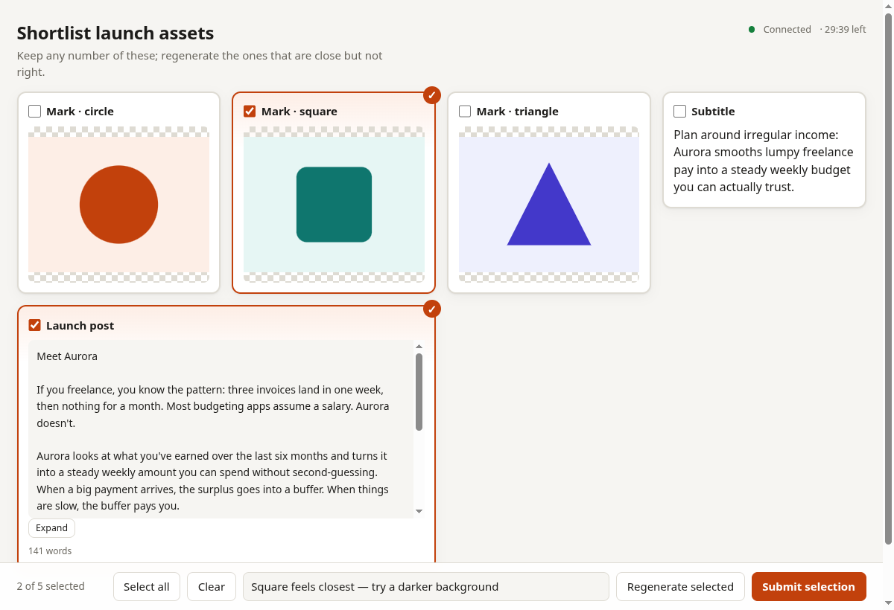
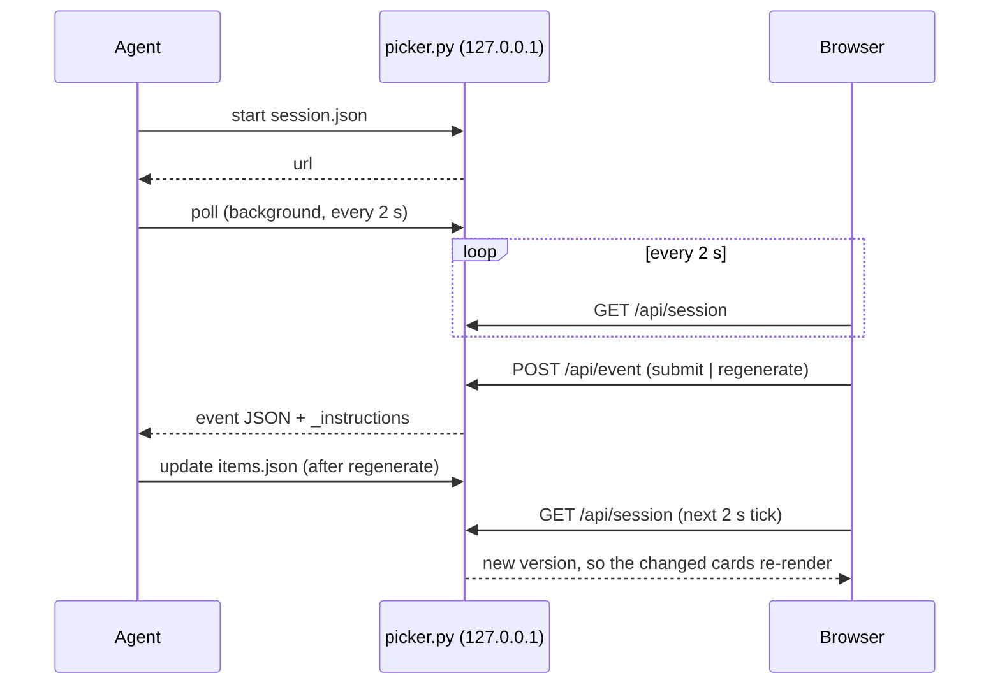

# claude-select

**Agent skill for Claude Code and Hermes Agent: pick winners from AI-generated options in a local web UI.**

[](https://github.com/tomkabel/claude-select/actions/workflows/test.yml)
[](https://www.python.org/downloads/)
[](#requirements)
[](https://docs.claude.com/en/docs/claude-code/plugins)
[](https://hermes-agent.nousresearch.com/docs/user-guide/features/skills)
[](LICENSE)

<picture>
  <source media="(prefers-color-scheme: dark)" srcset="docs/screenshot-dark.png">
  <source media="(prefers-color-scheme: light)" srcset="docs/screenshot-light.png">
  
</picture>

Ask an agent for four logo ideas or three draft intros and you usually get them
pasted into the chat. Comparing images there is awkward, and saying which ones
to redo is fiddly. claude-select gives the options a proper page on
`localhost`. You tick one winner or several, add a note, and submit or send
specific cards back for another try. The agent gets your choice back as
structured JSON and carries on.

## Highlights

- **Images, short text and long text** in one grid: png/jpg/svg/webp/gif with
  click-to-zoom, snippets up to 500 characters, and long drafts that scroll and expand.
- **Single-winner or multi-winner** modes (radio or checkbox, 0..N), with
  Select all and Clear.
- **Regenerate selected**: the agent receives each item's original prompt and
  parameters, re-runs only those, and the cards update in place with a `v2` badge.
- **Hard to break**: port fallback, retry after a dropped connection, empty-submit
  confirmation, session timeout, crash recovery, and the server shuts itself down when idle.
- **Zero dependencies**: one Python file (standard library, ≥ 3.10) and one HTML
  file. No npm, no build step.
- **Private to your machine**: binds `127.0.0.1` only, uses a per-session token,
  and guards against DNS rebinding. See [SECURITY.md](SECURITY.md).

## Contents

- [Requirements](#requirements)
- [Install](#install)
- [Quick start](#quick-start)
- [Usage](#usage)
- [How it works](#how-it-works)
- [Configuration](#configuration)
- [Troubleshooting](#troubleshooting)
- [Development](#development)
- [Contributing](#contributing)
- [License](#license)

## Requirements

- Python 3.10 or newer on `PATH` as `python3`. Standard library only, nothing to `pip install`.
- [Claude Code](https://docs.claude.com/en/docs/claude-code) or [Hermes Agent](https://hermes-agent.nousresearch.com).
- A browser on the same machine. For a remote agent, see [Troubleshooting](#troubleshooting).

Tested on Linux, macOS and Windows with Python 3.10 and 3.14.

## Install

### Claude Code

Install as a plugin from this repository:

```bash
claude plugin marketplace add tomkabel/claude-select
claude plugin install claude-select@claude-select
```

Restart Claude Code. Check that `/claude-select` appears when you type `/`.

<details>
<summary>Alternative: bare skill, no plugin</summary>

```bash
git clone https://github.com/tomkabel/claude-select.git
ln -s "$PWD/claude-select/skills/claude-select" ~/.claude/skills/claude-select
```

Use `<project>/.claude/skills/` instead of `~/.claude/skills/` to scope it to a single project.
</details>

### Hermes Agent

```bash
git clone https://github.com/tomkabel/claude-select.git
cp -r claude-select/skills/claude-select "${HERMES_HOME:-$HOME/.hermes}/skills/"
```

Start a new session and check it with `hermes skills list | grep claude-select`.

<details>
<summary>Alternative: load from the checkout, no copy</summary>

Add the checkout to `~/.hermes/config.yaml`, then `git pull` updates the skill in place:

```yaml
skills:
  external_dirs:
    - /path/to/claude-select/skills
```

Project-local installs (`<project>/.hermes/skills/`) need a one-time
`hermes skills trust` from the project root.
</details>

### Permissions

| The skill | Why | Where it's controlled |
|---|---|---|
| runs `python3 …/picker.py` | the only command it runs | pre-approved via `allowed-tools` in [SKILL.md](skills/claude-select/SKILL.md) |
| binds a port on `127.0.0.1` | serves the page | `CLAUDE_SELECT_PORT` (default 8765) |
| writes `~/.cache/claude-select/` | server state, crash-recovery copy, log | `CLAUDE_SELECT_HOME` |
| opens a browser tab | convenience | `start --no-open` |

## Quick start

Just ask. The skill triggers on requests for alternatives:

> Give me four hero image options for the pricing page and let me pick.

The agent generates the options, opens the page, and replies with one line:

```text
Options are ready: http://127.0.0.1:8765/?t=hks4JDNbYo1JQzrnoDZHXAvu
```

Pick, optionally add a note, then click **Submit selection** or **Regenerate
selected**. The agent is waiting in the background and continues on its own.

To try the page without an agent, drive it by hand:

```bash
python3 skills/claude-select/scripts/picker.py start examples/single-taglines.json
python3 skills/claude-select/scripts/picker.py poll   # blocks until you submit
```

```json
{
  "type": "submit",
  "selected_ids": ["t2"],
  "selection_mode": "single",
  "timestamp": "2026-09-23T05:31:07Z",
  "feedback": "",
  "selected": [{"id": "t2", "type": "short_text", "content": "Irregular income. Regular calm.", "...": "..."}],
  "_instructions": "User chose selected_ids; their full items are in `selected`. Continue the task with them ..."
}
```

## Usage

### Session file

The agent writes one JSON file per round. Image paths resolve relative to it.

```json
{
  "title": "Pick a tagline",
  "mode": "single",
  "timeout_s": 900,
  "tasks": {
    "tagline": {"prompt": "Hero tagline for Aurora, max 8 words", "params": {"tone": "warm"}}
  },
  "items": [
    {"id": "t1", "type": "short_text", "content": "Money that moves at your pace.",
     "metadata": {"label": "Option A"}, "generation_task_id": "tagline"}
  ]
}
```

| Field | Meaning |
|---|---|
| `mode` | `single`: exactly one winner. `multi`: any number, including none |
| `items[].type` | `image` (path, `http(s)://` or `data:image/` URL), `short_text` (≤ 500 chars), `long_text` |
| `items[].metadata` | `label` is the card title and `alt` is image alt text. Other keys show as small facts |
| `items[].generation_task_id` | key into `tasks`, which is what regenerate hands back |
| `tasks` | whatever the agent needs to re-run a generation, returned verbatim |
| `timeout_s` | seconds until the session expires (default 1800; each `update` resets it) |

Full JSON Schemas are in [protocol.md](skills/claude-select/references/protocol.md).

### Commands

`P` = `python3 skills/claude-select/scripts/picker.py`. Every command prints one
JSON object with an `_instructions` field telling the agent what to do next.

| Command | Does | Key output |
|---|---|---|
| `P start FILE [--port N] [--timeout S] [--no-open]` | validates, starts the server, opens the tab | `url`, `port`, `port_fallback` |
| `P poll [--timeout S]` | waits, checking every 2 s, for the next user action | a `submit`, `regenerate` or `timeout` event |
| `P update FILE` | replaces items with the same id and appends new ones; reopens the session | `version`, `pending` |
| `P status` | reports server and session state without consuming events | `browser_connected`, `remaining_s` |
| `P stop` | shuts the server down | `stopped` |

Exit code `0` means success and `1` means an error. The error JSON always names the fix.

### Example: multi-select with regeneration

Using [`examples/multi-mixed.json`](examples/multi-mixed.json): three SVG
logos, a subtitle and a 141-word post.

1. `P start examples/multi-mixed.json`, then `P poll`.
2. Tick **Mark · square**, type *darker, bolder*, and click **Regenerate selected**.
   The card greys out with "Regenerating…" and every action locks.
3. `poll` returns the original task for that card:
   ```json
   {"type": "regenerate", "selected_ids": ["logo-b"], "feedback": "darker, bolder",
    "tasks": [{"generation_task_id": "logo", "item_ids": ["logo-b"],
               "task": {"prompt": "Minimal geometric logo mark for Aurora, flat, two colours.",
                        "params": {"size": "240x180", "format": "svg"}}}]}
   ```
4. The agent re-runs it and pushes the result under the **same id**:
   `P update examples/regenerated-logo-b.json`, then `P poll` again.
5. Within 2 s the card shows the new image with a `v2` badge, still selected.
6. Tick the others you want and submit. `poll` returns every chosen item in full.

If you submit in multi mode with nothing ticked, the page asks you to confirm.
The agent then receives `selected_ids: []`, which it treats as "none of these
work": it reads your note and generates fresh options.

## How it works



The agent never speaks HTTP. It runs a CLI that prints JSON, so the same skill
works in any harness with a shell. `poll` runs as a background task
(`run_in_background` on Claude Code; `background` + `notify_on_complete` on
Hermes), and the harness wakes the agent when you click.

- [protocol.md](skills/claude-select/references/protocol.md): session, item and event schemas, endpoints, enforcement rules
- [design-notes.md](docs/design-notes.md): design decisions, prior art (impeccable `live` mode), and why polling instead of WebSockets

## Configuration

| Variable | Default | Effect |
|---|---|---|
| `CLAUDE_SELECT_PORT` | `8765` | first port tried; then the next 9, then any free port |
| `CLAUDE_SELECT_HOME` | `~/.cache/claude-select` | state, crash-recovery copy of the session, server log |

## Troubleshooting

| Symptom | Cause and fix |
|---|---|
| `port_fallback: true` | 8765 was busy, so another port was used. Harmless: the URL in the output is correct |
| `server_start_failed` | the output includes the log tail. Retry with `--port <free port>`; the agent falls back to chat after one retry |
| Page says *Connection lost, retrying…* | network blip, laptop sleep or a stopped server. The page keeps retrying, and a pending submit goes through once the same server answers again. After a restart, open the new URL |
| `poll` returns `server_unreachable` | the server died. `P start ~/.cache/claude-select/session.json` restores the latest items, including regenerated ones |
| Page says *This link has expired* | a newer session replaced this one. Use the newest URL |
| `timeout` event | nobody decided within `timeout_s`. `P update FILE` reopens the session |
| Agent on a remote machine | forward the port first: `ssh -L 8765:127.0.0.1:8765 host`, then open the URL locally |

## Development

```text
.claude-plugin/          plugin.json + marketplace.json (Claude Code)
skills/claude-select/    the skill, shared by both harnesses
├── SKILL.md             agent instructions; frontmatter registers it on both platforms
├── references/          protocol.md: schemas and endpoints
└── scripts/
    ├── picker.py        CLI + HTTP server
    ├── ui.html          the page (no build step)
    └── test_picker.py   end-to-end self-check
examples/                session files used in this README and the tests
docs/                    screenshots, design notes
```

```bash
python3 skills/claude-select/scripts/test_picker.py   # prints "ok"
ruff check skills/
claude plugin validate .
```

The self-check starts isolated servers in a temp directory. It covers input
validation, port fallback, token and Host checks, both modes, the regenerate/update
round trip, retry de-duplication, empty submit, timeout and stop. CI runs it on
Linux, macOS and Windows with Python 3.10 and 3.14, lints, rejects any non-stdlib
import, and validates the plugin manifests.

## Contributing

Issues and pull requests are welcome. Two house rules:

1. **No dependencies.** CI fails on any import outside the standard library.
2. **New behaviour needs an assertion** in `test_picker.py` that fails without the change.

Record user-visible changes in [CHANGELOG.md](CHANGELOG.md). Report security issues
privately as described in [SECURITY.md](SECURITY.md).

## License

[MIT](LICENSE) © Tom Kristian Abel
